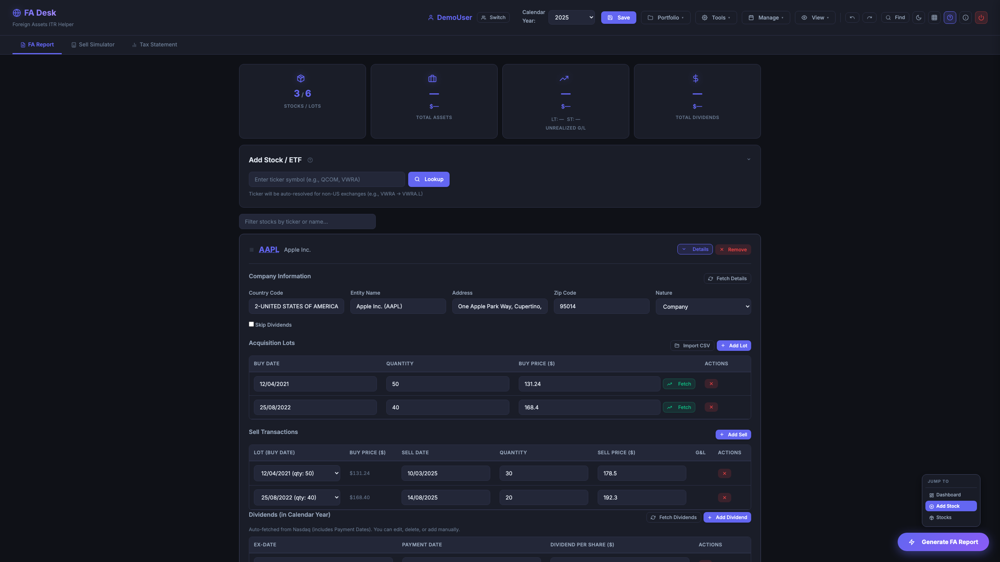
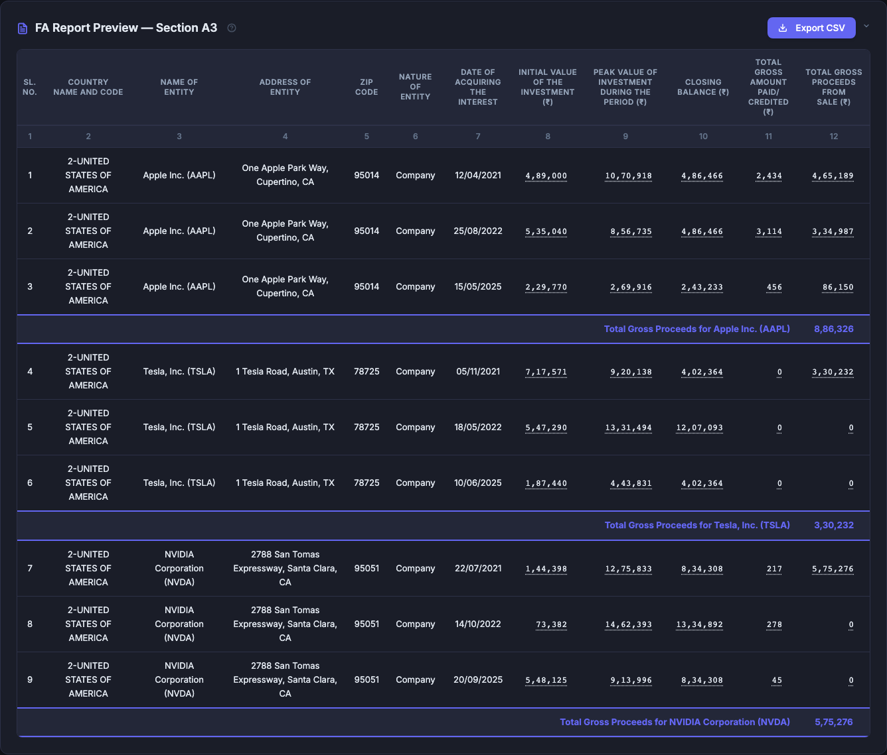
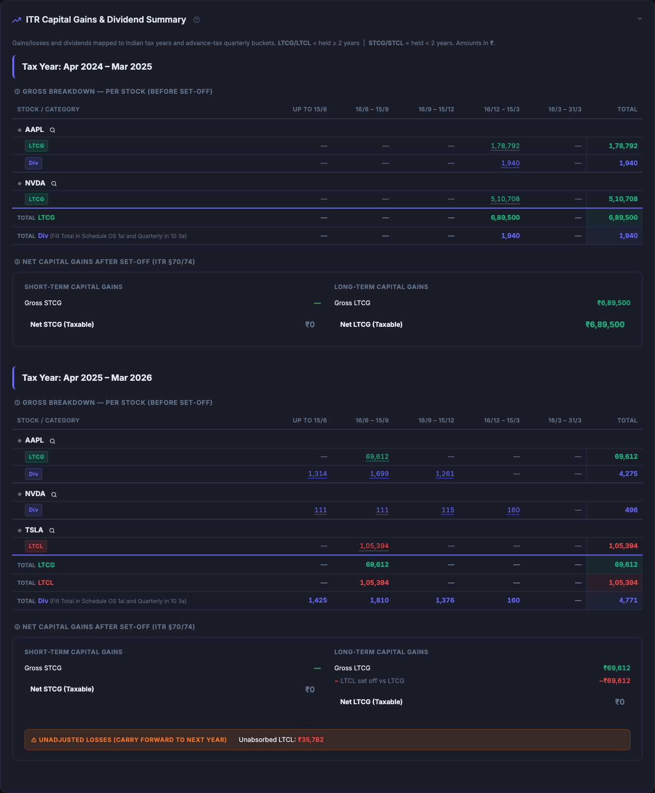
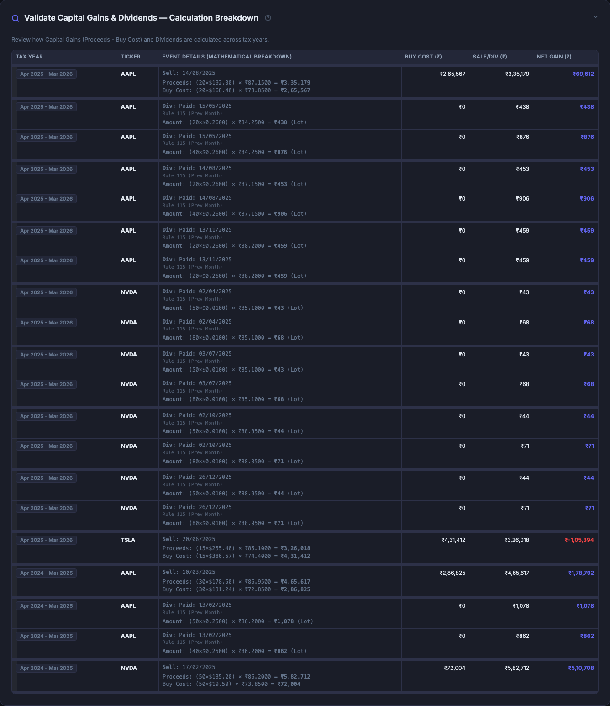
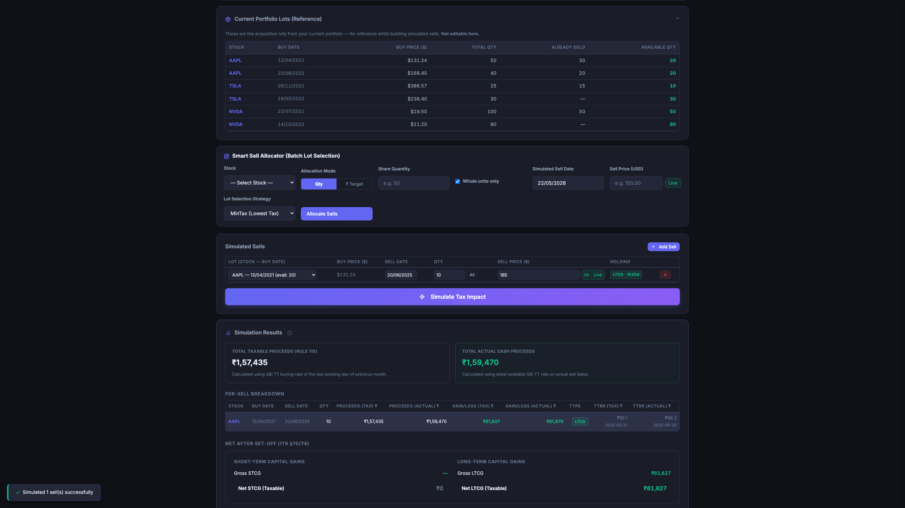
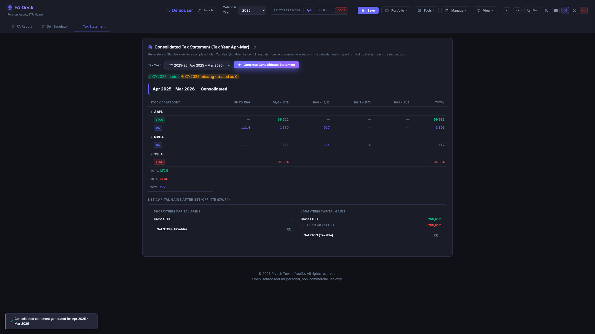
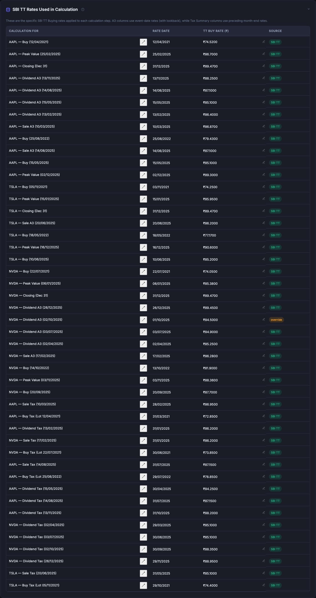
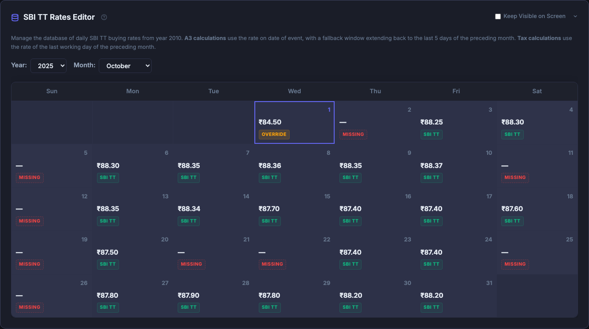
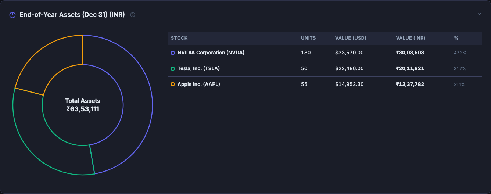
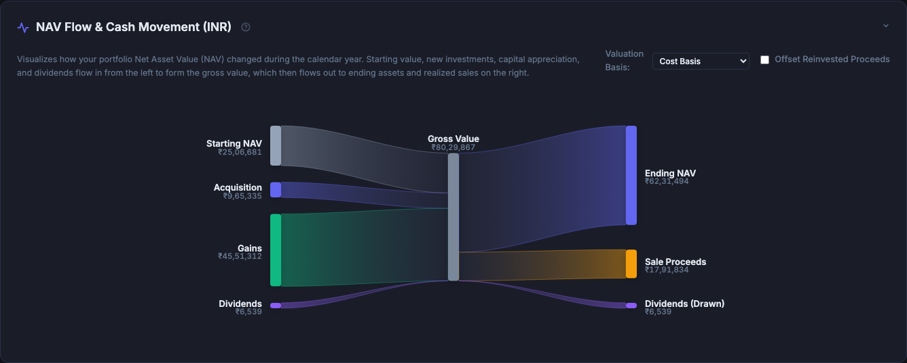

# Important Notice & Disclaimer
**This is an independent, open-source utility tool to assist with ITR data organization. It is not official tax software, and the author is not a Chartered Accountant.**

**This tool is provided "as is" without any guarantees of accuracy. Users are entirely responsible for manually verifying all calculations before submitting returns. By using this tool, you agree that the author is not liable for any filing errors, penalties, or financial losses.**

# FA Desk - Foreign Assets ITR Helper

A local web tool to automate filling Section A3 (Foreign Equity & Debt Interest) of Schedule FA in Indian Income Tax Return.

## Quick Start

### Option 1: Download the Portable App (Easiest)
1. Go to **[Releases](https://github.com/tepi3/itr_fa/releases/latest)** and download the executable for your OS (`fa_desk_macOS.zip`, `fa_desk_Windows.exe`, or `fa_desk_Linux`).
2. Run the executable — the app launches in a **standalone desktop window**.
3. Saved portfolios are stored in `~/.fa_desk_data`.

> **Note (Unsigned App):** Since the app is unsigned, your OS will show a security warning on first launch:
> - **Windows:** Click *More info* → *Run anyway* on the SmartScreen prompt.
> - **macOS:** Go to *System Settings > Privacy & Security*, find the blocked app message, and click *Open Anyway*. Alternatively, run `xattr -cr /path/to/fa_desk_macOS.app` in Terminal.

### Demo Profile (No Setup Required!)
Launch the app and click **Try with Demo Profile (CY2025)** to explore with a pre-loaded portfolio (AAPL, TSLA, NVDA with buy lots and partial sells). Generate reports, validate audits, simulate sells, and export CSV — all instantly.

### Option 2: Run via Python (For Developers)
```bash
# One-liner
git clone https://github.com/tepi3/itr_fa.git && cd itr_fa && pip3 install -r requirements.txt && python3 app.py

# Opens at http://127.0.0.1:5001 (port 5001 avoids macOS AirPlay conflicts)
```

## Features

### Portfolio Management
- **Auto stock lookup** — Enter a ticker symbol, company info auto-filled via Yahoo Finance.
- **E-Trade Import** — Parse Holdings reports (Expanded "By Status" View) or Gain & Loss `.xlsx` exports.
- **IBKR Import** — Upload Interactive Brokers CSV transaction history with automatic FIFO sells.
- **Morgan Stanley Import** — Upload MS at Work "Share Sale Cost Basis Report" (.xlsx) for RSU and ESPP history.
- **Tax-Lot Matching** — Supports partial sells and fractional shares.
- **Multi-User Profiles** — Separate portfolios per individual with dedicated local storage.
- **Manual Override** — Click any calculated cell to adjust values.

### SBI Rates & Currency
- **Dual-Rate Logic** — Automatically applies the correct SBI TT Buying Rate:
  - *Schedule FA (A3)*: Rate of the actual event date (Buy, Peak, Closing, Dividend, Sale) with lookback into the last 5 days of the preceding month.
  - *Tax Calculation (Rule 115)*: Rate on the last day of the preceding month with strict 5-day lookback.
- **Technical References**: [Rule 115/206](static/docs/Income_Tax_Rules_Rule_115_206.pdf) · [FSI/TR/FA Guide](static/docs/Guide_to_Fill_FSI_TR_FA_Schedule.pdf)
- **195 baseline month-end rates** built-in (Jan 2010 – Apr 2026).
- **Calendar Editor** — Sunday-aligned grid for daily rates since 2010; inline edits sync across the app.
- **Fetch Modes** — *Overwrite All* or *Only Add Missing* (preserves manual overrides).
- **Import/Export** — Backup and restore rates as JSON.
- **RBI Reference Rates** — Fetch and import official RBI daily exchange rates for secondary reference and audit verification.
- **Database Purge** — *Clear SBI TT Overrides* restores defaults, keeping only official SBI TT rates.

### Dividends
- **Auto-Fetch** on import or stock addition; fetches exact payment dates from Nasdaq for correct Rule 115 rate lookup.
- **Per-Stock or Batch Fetch** — Refresh dividends individually or for all stocks at once.

### Tax Computation
- **Schedule FA A3 Calculator** — All 12 portal columns (Initial/Peak/Closing Value, Dividends, Sale Proceeds) in ₹.
- **Validate A3 (Audit Trail)** — Click any cell for a full `Quantity × Price × Rate` breakdown. Overrides clearly flagged.
- **ITR Tax Year Summary** — LTCG/STCG and dividends mapped to Indian tax years with advance-tax quarterly buckets.
- **§70/74 Set-Off** — Automatic capital gains netting (STCL→STCG→LTCG, LTCL→LTCG) with carry-forward.
- **Consolidated Tax Statement** — Unified view for any Financial Year (Apr–Mar) by combining two calendar year reports.

### Sell Simulator & Smart Allocator
- **Batch Sell Allocation** — Select a stock and allocate sells by **Share Quantity** or **INR Target (₹)**.
- **INR Target Guarantee** — Auto-calculates required shares, applies lot constraints, ensures proceeds meet or exceed target.
- **Four Strategies** — MinTax (harvest losses first), MaxLoss, FIFO, and LIFO.
- **Dual-Proceeds Simulation** — Side-by-side comparison of actual vs. taxable (Rule 115) proceeds.
- **Calendar Year Locking** — Protects previous years from accidental edits.
- **Over-Allocation Guards** — Red highlights and tooltips for over-allocated lots; simulation disabled until corrected.

### Productivity
- **Undo/Redo** — Up to 50 levels (`Ctrl+Z` / `Ctrl+Shift+Z`, `⌘` on Mac).
- **Save/Open Anywhere** — Download/upload portfolio JSON to any folder, plus built-in server-side save.
- **Unsaved Changes Indicator** — Pulsing dot on Save button for unsaved modifications.
- **Interactive Tutorial & Inline Help** — Guided walkthrough with spotlight highlights; `?` icons for context help.
- **CSV Export** — ITR portal-compatible `.csv` output.
- **Resolution Scale** — Compact / Standard / Zoomed modes, persisted across sessions.

## Workflow

1. **Select User & Year** — Choose or create a profile; auto-loads previous portfolio.
2. **Fetch SBI Rates** — If rates are missing for your year.
3. **Import Data** — Upload E-Trade/IBKR docs or import from a previous year.
4. **Add Stocks/Lots** — Enter tickers and acquisition details manually.
5. **Fetch Dividends** — Pull exact dates and amounts from Nasdaq.
6. **Generate FA Report** — Compute all 12 portal columns.
7. **Review Tax Summary** — LTCG/STCG netting and Consolidated FY Statement.
8. **Export & Save** — Download CSV and save portfolio locally.

## Keyboard Shortcuts

| Shortcut | Action |
|----------|--------|
| `Ctrl+Z` / `⌘+Z` | Undo |
| `Ctrl+Shift+Z` / `⌘+Shift+Z` | Redo |
| `Ctrl+S` / `⌘+S` | Save Portfolio |
| `Ctrl+F` / `⌘+F` | Quick Search / Find |
| `?` | Toggle Keyboard Shortcuts Modal |

## Data Sources

- **Stock data**: [Yahoo Finance](https://finance.yahoo.com) via `yfinance`.
- **SBI TT rates**: [sbi-fx-ratekeeper](https://github.com/sahilgupta/sbi-fx-ratekeeper) (MIT License).

## Commission & Brokerage Handling

To comply with ITR Schedule FA requirements, the tool handles transaction costs as follows:
- **Acquisition Cost (Initial Value):** Commissions, brokerage, and fees are **included** in the buy cost. This represents the total historical cost of investment in INR.
- **Sale Proceeds (Schedule FA):** Commissions and fees are **excluded** from the sale proceeds. The tool reports **Gross Proceeds** to match the portal requirements for Section A3.
- **Capital Gains Summary:** To ensure consistency between the FA report and the Tax Summary, the tool uses **Gross Proceeds** for gain calculations as well. This means sale commissions are **not deducted** from the profit, resulting in a slightly higher (conservative) gain calculation that matches your FA disclosure.

## Project Structure

```text
itr_fa/
├── app.py                    # Flask server & API routes (Port 5001)
├── config.py                 # Configuration & data path resolution
├── desktop.py                # Standalone desktop entrypoint
├── requirements.txt          # Python dependencies
├── routes/                   # Flask Blueprints (calculator, market, parsers, portfolio, users)
├── core/                     # Backend logic (calculator, CSV export, parsers, SBI rates, models)
├── static/                   # Frontend (modular CSS & JS)
├── templates/index.html      # Main SPA template
└── tests/                    # Pytest test suite
```

## Notes

- **Local Only** — All data stored in `~/.fa_desk_data`. No cloud, no external accounts.
- **macOS** — Port 5001 avoids AirPlay Receiver conflict on port 5000.
- **License** — Open-source, free for personal non-commercial use.

## Visual Walkthrough

### 1. Profile & Tax Year Selection
Select or create a profile, choose your calendar year, or try the Demo Profile.


### 2. Portfolio Dashboard & Stock Cards
Track foreign assets with live prices and dynamic stat cards. Expand any stock to view acquisition lots, sells, and dividends. After generating the FA Report, dashboard metrics update with calculated values — total assets at cost, market value, dividends, and unrealized gains/losses.


### 3. Schedule FA Section A3 Report
All values converted to ₹ using exact date-of-event SBI TT buying rates.


### 4. Calculation Audit Trail
Verify every converted rupee with a clear mathematical breakdown showing precise exchange rates.


### 5. Capital Gains & Dividend Summary
STCG/LTCG and dividends mapped to Indian Tax Years with quarterly advance-tax buckets, plus step-by-step audit trail.



### 6. Sell Simulator
Simulate sales, fetch live prices, and preview STCG/LTCG tax impact before executing trades.


### 7. Consolidated Tax Statement
Unified tax statement combining calendar years to align with Indian Financial Years.


### 8. SBI TT Rates Used
Every exchange rate listed by stock and event, with exact date and source. Click any rate to override inline.


### 9. SBI TT Rates Calendar Editor
Edit daily rates in a Sunday-aligned calendar grid; inline edits sync across the app.


### 10. Asset Allocation
Interactive donut chart showing portfolio distribution across stocks as of Dec 31st in INR.


### 11. NAV Flow & Cash Movement
Sankey diagram showing portfolio NAV transitions: starting cost, deposits, dividends, and gains flowing to ending assets and realized sales.


---


**Copyright (c) 2026 Piyush Tewari (tepi3). All rights reserved.**
*Author: Piyush Tewari (tepi3)*
