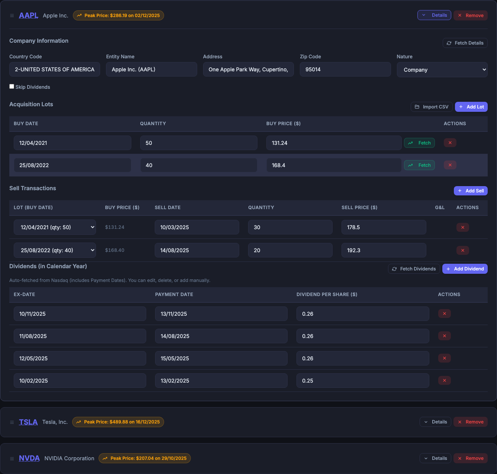
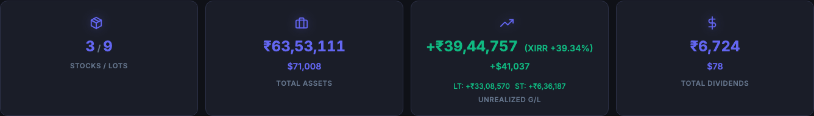

# Important Notice & Disclaimer
**This is an independent, open-source utility tool to assist with ITR data organization. It is not official tax software, and the author is not a Chartered Accountant.**

**This tool is provided "as is" without any guarantees of accuracy. Users are entirely responsible for manually verifying all calculations before submitting returns. By using this tool, you agree that the author is not liable for any filing errors, penalties, or financial losses.**

# FA Desk - Foreign Assets ITR Helper

A local web tool to automate filling Section A3 (Foreign Equity & Debt Interest) of Schedule FA in Indian Income Tax Return.

## Quick Start

### Option 1: Download the Portable App (Easiest)
You can run FA Desk without installing Python by downloading the standalone executable:
1. Go to the **[Releases](https://github.com/tepi3/itr_fa/releases/latest)** page on this GitHub repository.
2. Download `fa_desk_macOS.zip`, `fa_desk_Windows.exe`, or `fa_desk_Linux` from the **Assets** section.
3. Run the executable. The app will launch in a **standalone desktop window**.
   - *Note:* In developer/source mode, it still opens in your browser automatically.
   - *Note for Desktop users:* Refer to **Windows** or **macOS Installation** below to bypass security warnings.
   - *Data storage:* Your saved portfolios will be safely stored in a `.fa_desk_data` folder in your user's home directory.

   #### Windows Installation

   Because this app is currently unsigned, Windows SmartScreen will block it upon first launch. Please follow these steps to run the app:

   1. Double-click the `fa_desk_Windows.exe` file.
   2. When the blue "Windows protected your PC" screen appears, click **More info**.
   3. Click the **Run anyway** button that appears at the bottom.
   4. The application will now launch. You only need to do this once.

   ####  macOS Installation
   Because this app is currently unsigned, macOS will block it upon first launch. Please follow one of these methods to run the app:

   ##### Method 1: The "Open Anyway" (Recommended)
   1. Double-click the `fa_desk_macOS` app. When the warning appears, click **Done**.
   2. Open **System Settings > Privacy & Security**.
   3. Scroll down to the **Security** section.
   4. Look for the message: *"fa_desk_macOS" was blocked from use because it is not from an identified developer.*
   5. Click **Open Anyway**, enter your password, and click **Open** on the final dialog.

   ##### Method 2: The Terminal Bypass
   1. Open **Terminal**.
   2. Run the following command:
      ```bash
      xattr -cr /path/to/fa_desk_macOS.app
      ```
      *(Tip: You can drag the app icon directly into the terminal window to auto-fill the path).*

   The app will now open normally with a double-click.

### Onboarding Demo Profile (No Setup Required!)

If you want to quickly test the application's capabilities without importing or manually typing transaction data:
1. Launch the app (either standalone or via Python).
2. On the welcome/user selection screen, click the **Try with Demo Profile (CY2025)** button.
3. This will instantly initialize a profile named `DemoUser` and load a highly realistic pre-configured portfolio featuring:
   - **Apple Inc. (AAPL)**: 2 lots bought in 2021 & 2022, with partial sells in 2025.
   - **Tesla, Inc. (TSLA)**: 2 lots bought in 2021 & 2022, with partial sells in 2025.
   - **NVIDIA Corporation (NVDA)**: 2 lots bought in 2021 & 2022, with partial sells in 2025.
4. You can immediately click **Generate FA Report** to watch the progressive loader run, test validation audit details, view consolidated reports, simulate sells, and export formatted CSV sheets!

### Option 2: Run via Python (For Developers)

#### One-liner to Clone, Install & Run
```bash
git clone https://github.com/tepi3/itr_fa.git && cd itr_fa && pip3 install -r requirements.txt && python3 app.py
```

#### Manual Setup
```bash
# Clone the repository
git clone https://github.com/tepi3/itr_fa.git
cd itr_fa

# Install dependencies
pip3 install -r requirements.txt

# Run the app
python3 app.py

# Open in browser: http://127.0.0.1:5001
```
*Note: The app runs on port 5001 to avoid conflicts with macOS AirPlay (Control Center).*

## Features

### Portfolio Management
- **Auto stock lookup** — Enter ticker symbol (QCOM, NVDA, etc.), company info auto-filled via Yahoo Finance.
- **E-Trade Import** — Automatically parse your E-Trade Holdings reports (Expanded "By Status" View) to populate all acquisition lots and sale transactions.
- **E-Trade Sell Details Import** — Upload the Gain and Loss Expanded (G&L Expanded) exported `.xlsx` file from E-Trade to populate both acquisition lots and sell transactions.
- **IBKR Import** — Upload your Interactive Brokers CSV transaction history to build the portfolio and apply FIFO sells.
- **FIFO Sells** — Supports partial sells and fractional shares using First-In-First-Out logic.
- **Multi-User Profiles** — Manage separate portfolios for different individuals with dedicated local storage.
- **Manual Override** — Click any calculated cell in the results table to manually adjust values if needed.

### SBI Rates & Currency
- **Dual-Rate Logic** — Automatically applies the correct SBI TT Buying Rate based on context:
  - **Schedule FA (A3)**: Uses the rate of the **actual event date** (Buy, Peak, Closing, Dividend, Sale) with a lookback limit extending into the **last 5 days of the preceding month**. Highlight alerts flag lookup gaps > 5 days.
  - **Tax Calculation (Rule 115)**: Uses the rate on the **last day of the preceding month** with a strict **5-day lookback window**. Prompts exact date guidelines if rates are missing.
- **Technical References**:
  - [Rule 115 / 206 in Income Tax Rules](static/Income_Tax_Rules_Rule_115_206.pdf) — Rule for conversion of income into Rupees.
  - [Guide to Fill FSI, TR, and FA Schedule in ITR](static/Guide_to_Fill_FSI_TR_FA_Schedule.pdf) — Official guide from the Income Tax Department.
- **Base PDF rates (pre-2020)**: Shipped with a built-in, verified database of 120 base rates extracted directly from the official decade-long SBI TT buying rate PDF (2010–2019).
- **SBI TT Rates Calendar Editor**: Populate and edit daily rates for any month/year since 2010 in a modern Sunday-aligned calendar grid. Inline edits from the calendar or report table update the same active database cache.
- **Fetch Choices (Overwrite vs. Merge)**: Select between *Overwrite All* (updates active database including custom edits on conflicting dates) and *Only Add Missing* (merges fetched rates while fully preserving your manual overrides).
- **Import & Export**: Backup and restore your customized rates database as JSON using native, secure cross-platform dialogs on both Windows and macOS.
- **Refined Database Purge**: Click *Clear SBI TT Overrides* to securely restore original pre-2020 PDF rates to default, purge post-2020 fetched rates, and delete custom non-PDF rates in the cache.

### Dividends
- **Dividend Auto-Fetch** — Automatically fetches dividend events for the current year when importing data or adding stocks.
- **Exact Payment Dates** — Fetches precise historical payment dates from Nasdaq. This ensures the correct monthly SBI rate is automatically used for tax calculation as per Rule 115, eliminating the need for manual verification.
- **Per-Stock Fetch Dividends** — Re-fetch dividend data for any individual stock with a single click (Fetch Dividends button per stock card).
- **Batch Fetch All Dividends** — Refresh dividend data for all stocks at once from the header (Fetch All Dividends).

### Tax Computation
- **Schedule FA A3 Calculator** — Computes all 12 portal columns: Initial Value, Peak Value, Closing Balance, Dividends, and Sale Proceeds — all converted to ₹.
- **Validate A3 (Audit Trail)** — Provides a complete mathematical breakdown (`Quantity × Price × Rate`) for every calculated cell in Section A3.
  - **Click to Validate**: Click any calculated value in the A3 report table to instantly jump to its detailed breakdown in the validation section.
  - **Override Tracking**: Clearly flags cells where a manual override has been applied, while still showing the original calculated math.
- **ITR Tax Year Summary** — Capital gains (LTCG/STCG) and dividends mapped to Indian tax years with advance-tax quarterly buckets.
- **ITR §70/74 Set-Off** — Automatic capital gains netting: STCL vs STCG, residual STCL vs LTCG, LTCL vs LTCG, with carry-forward tracking.
- **Consolidated Tax Statement** — Generate a unified tax view for any complete Tax Year (Apr–Mar) by combining two calendar year reports. If a year's report is missing, that portion is treated as zero.

### Sell Simulator & Smart Allocator
- **Smart Sell Allocator (Batch Selection)** — Select any stock from your portfolio and batch-allocate sells with a single click. Choose between entering a **Share Quantity** or an **INR Target (₹)**.
- **INR Target Met Guarantee** — In INR Target mode, the allocator automatically calculates required share quantities based on the latest currency rates, applying individual lot constraint checks and ceiling rounding to guarantee your cash proceeds meet or exceed your target.
- **Four Allocation Strategies** — Optimize your draws using advanced batch drawdown algorithms:
  - **MinTax (Lowest Tax):** Sorts lots by prioritized tax brackets (STCL > LTCL > LTCG > STCG) then by gain/loss ascending to harvest capital losses first.
  - **MaxLoss (Harvest Loss):** Maximizes capital loss or minimizes capital gain based on current sell prices.
  - **FIFO (First In, First Out):** Drawdowns from the oldest buy lots first.
  - **LIFO (Last In, First Out):** Drawdowns from the newest buy lots first.
- **Dual-Proceeds Simulation (Actual vs. ITR Tax)** — Simultaneously simulates and compares actual cash proceeds and tax proceeds:
  - **Tax proceeds:** Computed using the SBI TT rate of the last working day of the previous month (Rule 115).
  - **Actual proceeds:** Computed using the latest available SBI TT rate on the exact simulated sell date.
- **Side-by-Side Proceeds Cards & Table** — Displays a side-by-side summary grid comparing total actual vs. taxable proceeds, plus highly condensed, compact breakdowns with no horizontal scrolling.
- **Calendar Year Locking & Protection** — Automatically detects the active running calendar year (e.g. 2026) and locks editing to it. If the running year is unavailable, it dynamically falls back to the year in which the user opened the simulator to protect previous years from manual changes. Dropdown modifications automatically redirect to the main portfolio page.
- **Manual Over-Allocation Safety Guards** — Highlights overallocated acquisition lots in premium red (`.qty-over-limit`) with clear warning tooltips, and disables the simulation button until errors are corrected.

### Productivity
- **Undo / Redo** — Undo any portfolio change (add/remove stock, lot, sell, dividend) with Undo or **Ctrl+Z** (⌘+Z on Mac). Redo with Redo or **Ctrl+Shift+Z**. Supports up to 50 levels.
- **Save / Open Anywhere** — Use the "Save As" and "Open..." buttons to download your portfolio JSON to any external folder on your computer, or load it from any directory, in addition to the built-in server-side Save/Load.
- **Unsaved Changes Indicator** — A pulsing dot on the Save button warns you about unsaved portfolio modifications.
- **Interactive Tutorial** — Click Help to launch a guided step-by-step walkthrough of every feature with spotlight highlights.
- **Inline Help** — Click the ? icons next to section headers for quick context-sensitive help.
- **CSV Export** — Generate ready-to-use `.csv` reports strictly matching the ITR portal's Schedule FA A3 template.
- **Resolution Scale / UI Density** — Toggle between **Compact**, **Standard**, and **Zoomed** modes directly from the header dropdown menu. This dynamically resizes font sizes and spacing to fit large reports on high-DPI displays (2K/4K) or increase visibility on small screens. Your preference is persisted automatically across sessions.

## Workflow

1.  **Select User & Year** — Choose an existing profile or create a new one. The app will automatically try to load your portfolio or import holdings from the previous year.
2.  **Fetch SBI Rates** — Click "Fetch SBI Rates" button (if rates are missing for your year).
3.  **Import Data (Optional)** — Click "Upload ETRADE Docs" to import holdings and/or sell transactions, or use "Import Prev Year" to bring over holdings from a previous year's save.
4.  **Add Stocks/Lots Manually** — Enter ticker symbols and add acquisition lots (date, quantity, price) or sells as needed.
5.  **Fetch Dividends** — Click "Fetch All Dividends" to pull exact historical data (Ex-Date, Payment Date, and Amount) from Nasdaq.
6.  **Calculate** — Click "Generate FA Report" to compute all 12 portal columns.
7.  **Review Tax Summary** — Review the ITR Tax Year Summary with LTCG/STCG netting, or generate a Consolidated FY Statement.
8.  **Export** — Click "Export CSV" to download the formatted file for tax filing.
9.  **Save** — Click "Save" to store your portfolio locally for future use.

## Keyboard Shortcuts

| Shortcut | Action |
|----------|--------|
| `Ctrl+Z` / `⌘+Z` | Undo |
| `Ctrl+Shift+Z` / `⌘+Shift+Z` | Redo |
| `Ctrl+S` / `⌘+S` | Save Portfolio |
| `Ctrl+F` / `⌘+F` | Quick Search / Find |
| `?` | Toggle Keyboard Shortcuts Help Modal |

## Data Sources

- **Stock data**: [Yahoo Finance](https://finance.yahoo.com) via `yfinance` (free, no login).
- **SBI TT rates**: [sbi-fx-ratekeeper](https://github.com/sahilgupta/sbi-fx-ratekeeper) on GitHub (free, MIT License).

## Files

```text
itr_fa/
├── .github/
│   └── workflows/
│       └── build.yml         # GitHub Actions CI/CD for portable binaries
├── app.py                    # Flask server & API routes (Port 5001)
├── config.py                 # Configuration constants & data path resolution
├── desktop.py                # Standalone application entrypoint
├── requirements.txt          # Python dependencies (Flask, yfinance, openpyxl)
├── routes/                   # Flask Blueprints (API endpoints)
│   ├── calculator.py
│   ├── market.py
│   ├── parsers.py
│   ├── portfolio.py
│   └── users.py
├── core/                     # Core backend logic
│   ├── calculator.py         # A3 column calculations & tax year summary
│   ├── csv_export.py         # ITR-compliant CSV generation
│   ├── etrade_parser.py      # E-Trade report parser (CSV/XLSX)
│   ├── ibkr_parser.py        # IBKR report parser (CSV)
│   ├── merger.py             # Data merging utility
│   ├── models.py             # Data models
│   ├── sbi_rates.py          # SBI TT rate fetch, cache, and locking
│   ├── smart_import.py       # Intelligent data importing logic
│   ├── stock_data.py         # Yahoo Finance wrapper
│   └── utils.py              # Shared utility functions
├── static/                   # Frontend assets
│   ├── css/                  # Modular CSS styles
│   │   ├── base.css
│   │   ├── layout.css
│   │   ├── style.css
│   │   ├── components/
│   │   └── views/
│   └── js/                   # Modular JavaScript
│       ├── main.js           # Main application logic
│       └── modules/          # Split JS modules
├── templates/
│   └── index.html            # Main SPA template
└── tests/                    # Pytest test suite
```

## Notes

- **Local Only**: All data is stored locally on your machine in the `~/.fa_desk_data` folder. No cloud hosting or external accounts are used.
- **macOS Compatibility**: Port moved to 5001 to resolve 403 Forbidden errors caused by AirPlay Receiver on port 5000.
- **Using Upload Etrade**: Current Holding will not contain sold stocks.
- **License**: This tool is open-source and free for personal, non-commercial use.

## Visual Walkthrough & Features

Here is a preview of the key features and modern dark-mode user interface of FA Desk:

### 1. Profile & Tax Year Selection
On launch, select or create your profile, choose your calendar year, or quickly explore the app using the pre-configured onboarding Demo Profile.


### 2. Portfolio Dashboard & Stock Cards
Track your foreign assets (such as US stocks and ETFs) with live Yahoo Finance prices and dynamic portfolio stat cards.


#### Detailed Stock Holdings (Acquisition Lots, Sells, and Dividends)
Expand any stock card to view its complete composition: detailed acquisition lots, recorded sell transactions, and historical dividend payments mapped precisely to payment dates.


#### Portfolio Metrics Overview
After generating the FA Report, the dashboard metrics update to reflect calculated values — total assets at cost, current market value, total dividends received, and net unrealized gains/losses across your entire portfolio.


### 3. Schedule FA Section A3 Report
Generate your Schedule FA Section A3 report converted to Indian Rupees (₹) using exact date-of-event SBI TT buying rates.


### 4. Calculation Audit Trail (Validate A3)
Verify every single converted rupee with a crystal-clear mathematical audit trail showing the precise exchange rates and parameters used.


### 5. ITR Capital Gains & Dividend Summary
Automatically map your capital gains (STCG/LTCG) and dividends into Indian Tax Years (April–March) and quarterly advance-tax buckets.


#### Capital Gains & Dividend Audit Trail (Validate Tax Summary)
Gain absolute clarity on your tax calculations with a step-by-step math breakdown for both Capital Gains and Dividend Tax schedules, including matching details and exchange rates under Rule 115.


### 6. Sell Simulator & Tax Impact Simulator
Simulate hypothetical sales based on your current holdings, fetch live intraday prices, and preview STCG/LTCG tax impacts before executing trades.


### 7. Consolidated Tax Statement
Generate a unified tax statement combining multiple calendar years to perfectly align with Indian Financial Years.


### 8. SBI TT Rates Used in Calculation
Every exchange rate applied during report generation is listed in full — stock by stock, event by event (Buy, Peak, Closing, Dividend, Sale) — with the exact rate date and source. Click any rate to override it inline.


### 9. SBI TT Rates Calendar Editor
Populate and edit daily rates for any month/year since 2010 in a modern Sunday-aligned calendar grid. Inline edits from the calendar or report table update the same active database cache.


### 10. End-of-Year Asset Allocation
Visualize how your foreign portfolio is distributed across stocks as of December 31st with an interactive donut chart showing INR values and percentage breakdown.


---


**Copyright (c) 2026 Piyush Tewari (tepi3). All rights reserved.**
*Author: Piyush Tewari (tepi3)*
